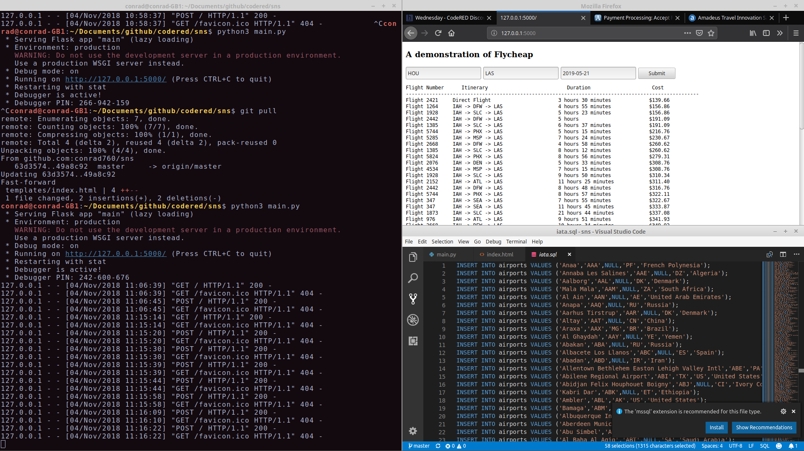

# Fly Cheap

## [CodeRed](https://uhcode.red/#1)

---
> An application that takes some location inputs from the user and finds the cheapest flight
---

Going further from this we hope to implement it on a website using Domain.com and visualize the jumps between airports with the 
here API. After finding the cheapest flight your list of tickets could be purchased from us through us with Authorize.Net. 

---

## Learn more about the team

Conrad Parker – [conrad760](https://github.com/conrad760) – conradlparker@gmail.com

Toan-James Le – [JamzJamzJamz](https://github.com/JamzJamzJamz) – le.toanjames@gmail.com

Khalid Hourani – [KalHourani](https://github.com/KalHourani) – khalid.hourani@gmail.com
